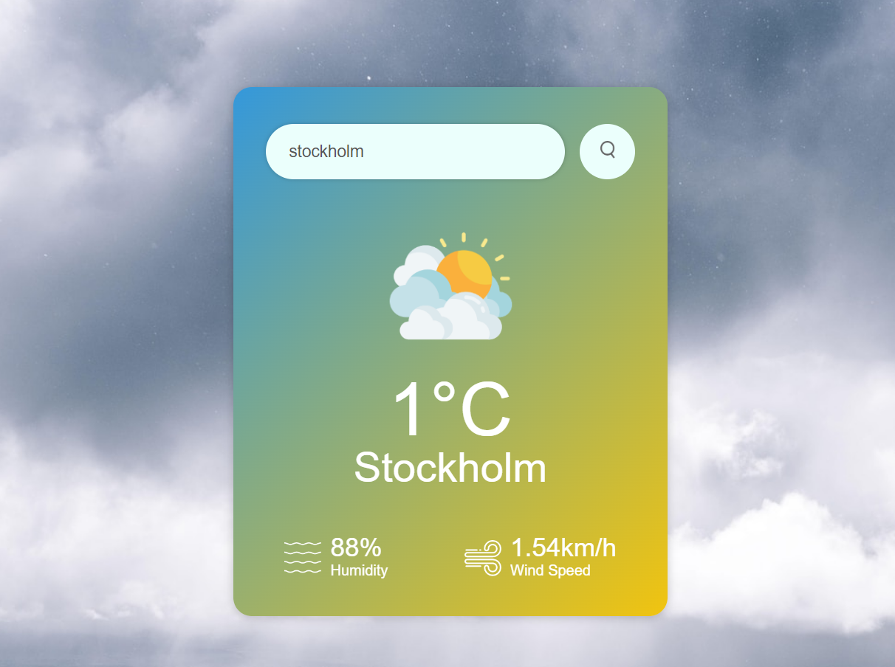

# **Project: Weather Application**

**Demo Link:**[ Weather App Demo](https://noor-ismot.github.io/Find-Weather/)

**Programming Language:** HTML, CSS, Javascript      

**Project Description:**

I developed a responsive Weather App using HTML, CSS, and JavaScript that allows users to check the current weather conditions of any city. Users can enter a city name, and the app fetches real-time weather data using the OpenWeatherMap API. The app displays the temperature, humidity, wind speed, and weather icon corresponding to the current weather conditions of the city.

**Challenges Faced:**

One of the challenges I faced was handling errors when the user entered an invalid city name or when the city is not found in the OpenWeatherMap database. I addressed this challenge by implementing error handling mechanisms to display appropriate messages to the user and gracefully handle such scenarios.  
                                                       Copyright © Noor Ismot Ara- All rights reserved
